# ERD — Aplikasi Pencatatan Keuangan Keluarga (v2)

## Konsep dasar

- **Household** adalah unit keluarga yang menaungi beberapa `user`. Role hanya 2: **admin** (Kepala Keluarga, e.g. **Bayu**, kendali penuh) dan **member** (pasangan/anggota lain, e.g. **Annisa** — hanya bisa melihat data household terisolasi dan mencatat lewat wallet yang di-assign admin). `can_edit_others_transactions` adalah satu-satunya permission granular yang dibutuhkan saat ini (boleh/tidak edit transaksi milik member lain).
- **Quick Role Switcher**: Disediakan switcher instan di header aplikasi (`Bayu (Admin)` vs `Annisa (Member)`) untuk pengujian prototype.
- **Wallet**, **investasi**, **utang/piutang**, dan **budget** memakai pola ownership yang sama: `owner_user_id` atau `owner_household_id` — salah satu diisi, tidak dua-duanya (ditegakkan via check constraint).
- Akses wallet shared hanya 1 level lewat `wallet_access` — begitu di-assign, member bisa melihat & mencatat di wallet tersebut.
- **Kategori** milik household (dikelola admin), dan satu kategori bisa dipakai untuk income maupun expense — tipe transaksi ditentukan di `transactions.type`, bukan di kategori. Kategori sistem (`is_system`) tidak bisa dihapus, hanya disembunyikan (`is_hidden`).
- **Transfer** antar wallet punya entity sendiri, terpisah dari `transactions`, supaya perpindahan saldo tidak tercatat ganda sebagai income+expense dan tidak merusak perhitungan net worth. Member dapat melakukan transfer dari wallet miliknya ke wallet mana saja di household.
- **Overbudget & Insufficient Balance Warning**: Notifikasi visual (Toast Sonner + Warning Alert) langsung aktif apabila saldo dompet kurang atau pengeluaran melebihi budget bulanan kategori.
- **`transactions.owner_id`** (siapa punya uangnya, untuk toggle mode Saya/Pasangan/Gabungan) dipisah dari **`transactions.recorded_by`** (siapa yang input) — penting karena satu orang bisa mencatat transaksi atas nama anggota lain.
- **Void & koreksi** (bukan hard delete) berlaku di semua entity pergerakan uang: `transactions`, `transfers`, `debt_payments`, `investment_transactions` — masing-masing punya `status` (active/void) dan `correction_of_id` (self-reference ke record yang dikoreksi).
- **Rekonsiliasi wallet** (`wallet_reconciliations`, cek manual saldo tercatat vs aktual kapan saja) dan **snapshot saldo** (`wallet_balance_snapshots`, otomatis tiap akhir bulan untuk grafik net worth) adalah dua konsep terpisah.
- Investasi memisahkan riwayat transaksi beli/jual (`investment_transactions`, sekarang punya `wallet_id` sebagai sumber/tujuan dana) dari riwayat harga pasar (`investment_valuations`). Kolom `source` (manual/scrape/api) disiapkan dari awal untuk transisi ke integrasi otomatis nanti.
- **Utang/piutang** digabung dalam satu tabel `debts` (kolom `type`), dengan split kepemilikan lewat 2 kolom tetap (`portion_admin`, `portion_member`) dan riwayat cicilan di `debt_payments`. Pembayaran oleh member hanya boleh dilakukan via wallet yang di-assign padanya.
- **Budget** menyasar satu kategori per periode (mingguan/bulanan/tahunan), dengan ownership sama seperti wallet/investasi/utang.
- **Audit log** adalah tabel generik/polymorphic (`entity_type` + `entity_id`) yang mencatat semua perubahan lintas entity — bukan tabel audit terpisah per entity.
- **Household invite** lewat kode/link (`household_invites`) untuk mengundang pasangan bergabung.

## Diagram

```mermaid
erDiagram
  USERS ||--o{ HOUSEHOLD_MEMBERS : joins
  HOUSEHOLDS ||--o{ HOUSEHOLD_MEMBERS : has
  HOUSEHOLDS ||--o{ HOUSEHOLD_INVITES : issues
  USERS ||--o{ WALLETS : owns
  HOUSEHOLDS ||--o{ WALLETS : owns
  WALLETS ||--o{ WALLET_ACCESS : grants
  USERS ||--o{ WALLET_ACCESS : has
  WALLETS ||--o{ WALLET_RECONCILIATIONS : has
  WALLETS ||--o{ WALLET_BALANCE_SNAPSHOTS : has
  HOUSEHOLDS ||--o{ CATEGORIES : defines
  CATEGORIES ||--o{ TRANSACTIONS : classifies
  WALLETS ||--o{ TRANSACTIONS : records
  USERS ||--o{ TRANSACTIONS : owns_and_records
  WALLETS ||--o{ TRANSFERS : source_of
  WALLETS ||--o{ TRANSFERS : destination_of
  USERS ||--o{ DEBTS : owns
  HOUSEHOLDS ||--o{ DEBTS : owns
  DEBTS ||--o{ DEBT_PAYMENTS : has
  WALLETS ||--o{ DEBT_PAYMENTS : via
  USERS ||--o{ INVESTMENTS : owns
  HOUSEHOLDS ||--o{ INVESTMENTS : owns
  INVESTMENTS ||--o{ INVESTMENT_TRANSACTIONS : has
  WALLETS ||--o{ INVESTMENT_TRANSACTIONS : via
  INVESTMENTS ||--o{ INVESTMENT_VALUATIONS : has
  CATEGORIES ||--o{ BUDGETS : targets
  USERS ||--o{ BUDGETS : owns
  HOUSEHOLDS ||--o{ BUDGETS : owns
  USERS ||--o{ AUDIT_LOGS : performs

  USERS {
    uuid id PK
    string name
    string email
    string base_currency
  }
  HOUSEHOLDS {
    uuid id PK
    string name
  }
  HOUSEHOLD_MEMBERS {
    uuid household_id FK
    uuid user_id FK
    enum role "admin | member"
    boolean can_edit_others_transactions
  }
  HOUSEHOLD_INVITES {
    uuid id PK
    uuid household_id FK
    uuid invited_by FK
    string code
    string status
    datetime expires_at
  }
  WALLETS {
    uuid id PK
    uuid owner_user_id FK "nullable, exclusive with owner_household_id"
    uuid owner_household_id FK "nullable, exclusive with owner_user_id"
    string name
    string type "bank | ewallet | cash"
    string currency
  }
  WALLET_ACCESS {
    uuid wallet_id FK
    uuid user_id FK
    uuid assigned_by FK "admin yang meng-assign"
  }
  WALLET_RECONCILIATIONS {
    uuid id PK
    uuid wallet_id FK
    decimal recorded_balance
    decimal actual_balance
    date date
    uuid adjustment_transaction_id FK "nullable"
  }
  WALLET_BALANCE_SNAPSHOTS {
    uuid id PK
    uuid wallet_id FK
    decimal balance
    date snapshot_date
  }
  CATEGORIES {
    uuid id PK
    uuid household_id FK
    uuid parent_id FK "nullable, sub-kategori"
    string name
    boolean is_system
    boolean is_hidden
  }
  TRANSACTIONS {
    uuid id PK
    uuid wallet_id FK
    uuid category_id FK
    uuid owner_id FK "milik siapa uangnya"
    uuid recorded_by FK "siapa yang input"
    string type "income | expense"
    decimal amount
    date date
    string note
    string attachment_url
    string status "active | void"
    uuid correction_of_id FK "nullable, self-reference"
  }
  TRANSFERS {
    uuid id PK
    uuid from_wallet_id FK
    uuid to_wallet_id FK
    decimal amount
    decimal fee
    date date
    string status "active | void"
    uuid correction_of_id FK "nullable"
  }
  DEBTS {
    uuid id PK
    uuid owner_user_id FK "nullable, exclusive with owner_household_id"
    uuid owner_household_id FK "nullable, exclusive with owner_user_id"
    string type "utang | piutang"
    string counterparty
    decimal principal
    decimal portion_admin
    decimal portion_member
    date due_date
    string status
  }
  DEBT_PAYMENTS {
    uuid id PK
    uuid debt_id FK
    uuid wallet_id FK
    decimal amount
    date date
    string status "active | void"
    uuid correction_of_id FK "nullable"
  }
  INVESTMENTS {
    uuid id PK
    uuid owner_user_id FK "nullable, exclusive with owner_household_id"
    uuid owner_household_id FK "nullable, exclusive with owner_user_id"
    string asset_type "emas | perak | crypto | saham"
    string asset_name
    string unit
  }
  INVESTMENT_TRANSACTIONS {
    uuid id PK
    uuid investment_id FK
    uuid wallet_id FK "sumber/tujuan dana"
    string type "buy | sell"
    decimal quantity
    decimal price
    date date
    string status "active | void"
    uuid correction_of_id FK "nullable"
  }
  INVESTMENT_VALUATIONS {
    uuid id PK
    uuid investment_id FK
    decimal price_per_unit
    date date
    string source "manual | scrape | api"
  }
  BUDGETS {
    uuid id PK
    uuid category_id FK
    uuid owner_user_id FK "nullable, exclusive with owner_household_id"
    uuid owner_household_id FK "nullable, exclusive with owner_user_id"
    string name
    decimal target_amount
    string period "weekly | monthly | yearly"
    date start_date
  }
  AUDIT_LOGS {
    uuid id PK
    uuid actor_id FK
    string entity_type
    uuid entity_id
    string action
    json before_data
    json after_data
    datetime created_at
  }
```

